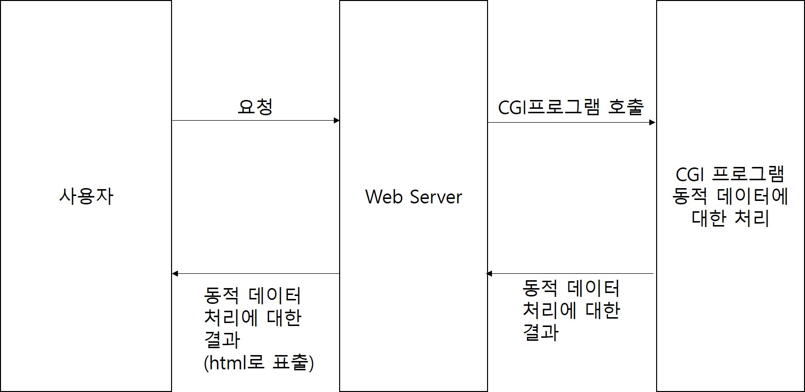
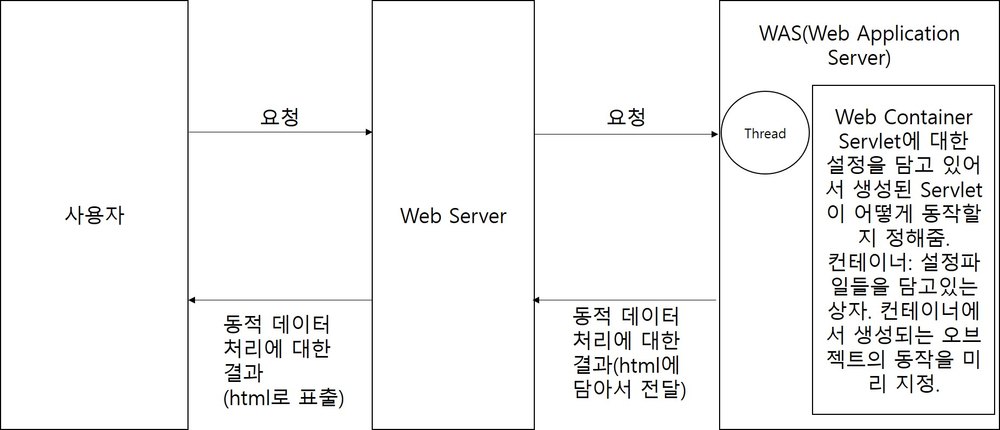
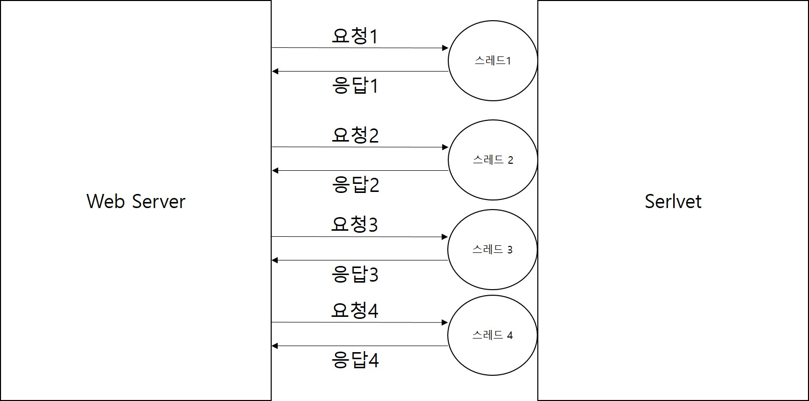
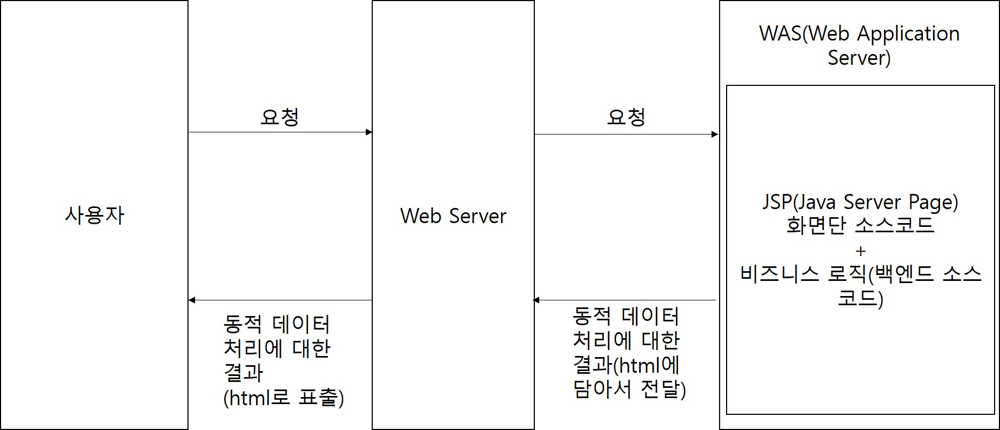
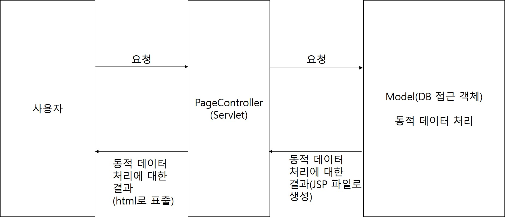
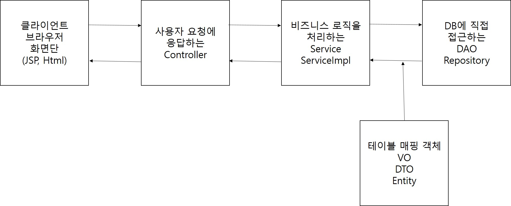
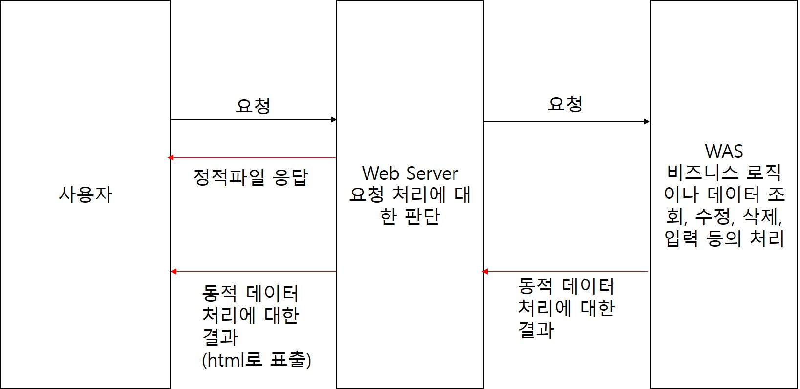
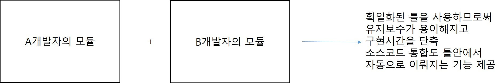
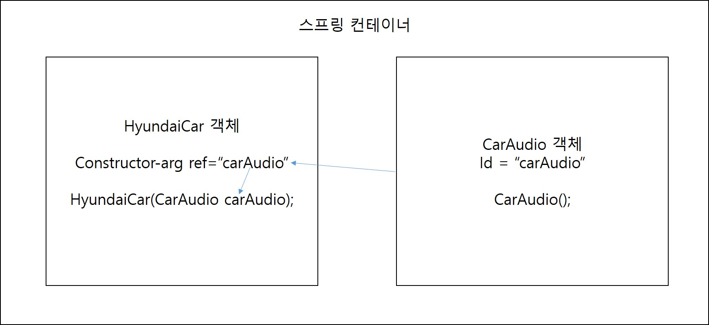
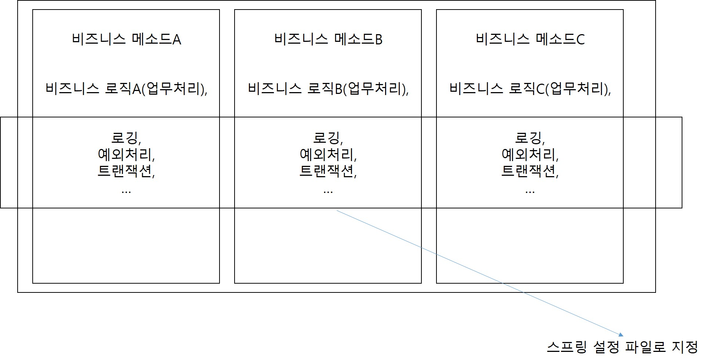

# 1. SpringFramework
## 1. 웹 개발의 역사
### 1. Servlet의 등장 전
1. 초창기 웹은 html, css 파일(정적파일)만 주고받고 할 수 있는 형태의 웹
2. 
3. DB에 있는 데이터를 가져와서 동적으로 표시할 방법이 없는 문제점이 발생 -> 개발자들이 동적 데이터를 표시할 방법을 찾기 시작

### 2. CGI 프로그램
1. CGI(Common Gateway Interface): 동적 데이터 처리에 대한 규약
2. 클라이언트(사용자)가 요청을 보내면 Web서버에서 CGI프로그램을 호출하여 동적 데이터를 처리하는 방식.
3. CGI프로그램은 요청당 하나의 프로세스를 생성하여 동적데이터에 대한 처리를 하였다.
4. 
5. 대형 사이트들이 등장하면서 다수의 사용자에 대한 처리에서 문제가 발생했다.
6. CGI 프로그램이 프로세스 기반이었기 때문에 한 사용자의 요청이 끝나기 전에는 다른 사용자의 요청에 대한 처리를 시작할 수 없었다.
7. 
8. 다수의 사용자가 요청을 보냈을 때 마지막에 요청을 보낸 사용자는 앞의 요청들이 모두 끝날때까지 대기해야하는 문제와 요청당 프로세스를 하나씩 생성하면서 메모리부족과 CPU점유율 증가로 인한 서버PC 중단현상이 빈번하게 발생했다.

### 3. Servlet
1. 위 CGI프로그램의 문제점들을 해결하기 위해 고안된 방식. 요청 당 하나의 프로세스를 생성하지 않고 스레드를 생성해서 멀티 스레드 방식의 병렬처리를 통한 다수의 요청을 처리하도록 구현.
2. Servlet은 자바 코드로 html 태그들을 생성할 수 있다.
3. 
4. 
5. 스레드 기반의 비동기 처리방식이기 때문에 먼저 들어온 요청이 먼저 끝날수도 있고 나중에 들어온 요청이 먼저 끝날 수도 있는 시스템.
6. Servlet의 문제점은 Java코드로 html을 구성하는 게 매우 복잡하고 어려웠다는 점이다.

### 4. JSP(Java Server Page) - Model 1 방식
1. Java 코드로 html을 구성하는 게 비효율적이기 때문에 JSP는 html 웹 문서를 구성하고 그 안에서 Java 코드를 사용할 수 있는 방식.
2. JSP 한 파일에 자바 + Html + Css + JavaScript 소스코드가 모두 존재.
3. JSP는 화면단 소스와 비즈니스 로직(자바에서 처리할 내용)들이 한 파일에 작성되었다.
4. 
5. 모든 소스코드가 JPS에 몰려있다 보니 소스코드가 어지럽고 더러운 문제가 발생했고 소스코드를 분석하기도 쉽지 않았다.

### 5. Model 2 방식(JSP/Servlet 방식)
1. Model1 방식의 소스코드 분석의 문제가 발생하면서 화면단과 비즈니스 로직을 분리하는 Model2 방식으로 발전이 이뤄졌다.
2. 화면단 소스 코드는 JSP가 비즈니스 로직은 Servlet이 처리하는 형태의 방식
3. 현재 제일 많이 사용되는 MVC(Model View Controller)방식의 시초.
4. 

### 6. MVC(Model View Controller) 패턴
1. 모델2 방식이 좀 더 구체화 되면서 발전된 형태의 디자인 패턴
2. 모델2 방식에서는 PageController(Servlet)가 하나만 존재하는 형태에서 MVC패턴에서는 기능별 Controller(일반 Servlet이 아닌 Http프로토콜(규약) HttpServlet(Spring에서 제공해주는)을 상속받아서)를 생성
3. Model(DB 접근 객체: DAO, Repository, 비즈니스 로직: Service, Service를 상속받은 ServiceImpl, 테이블 매핑 객체: VO, DTO, Entity), View(JSP, Html, ...), Controller(Controller(Serlvet을 상속받은))
4. 

## 2. WEB/WAS
### 1. WEB 서버
1. 클라이언트(사용자)의 요청을 가장 먼저 받아주는 서버
2. 요청을 WEB 서버에서 처리할 것인지 아니면 WAS로 전달할 것인지 판단하여 처리. 사용자 요청이 단순 정적파일 요청이라면 WEB 서버에서 바로 사용자에게 정적파일(Html, Css, jpg, png, js, ...)을 보내준다.
3. 컴파일이나 DB에 데이터를 가져오는 로직등 비즈니스 로직이 필요한 경우 사용자 요청을 WAS로 전달. WAS에서 처리된 결과가 WEB 서버로 오고 WEB 서버는 사용자에게 그 결과를 전달해주는 형태.
4. WEB 서버는 기본적으로 80포트를 사용하게 되어있는 데 설정파일에서 변경가능.
5. 많이 사용되는 WEB의 종류는 Apache, IIS, nginx, WebtoB, ... 등이 있다.
### 2. WAS(Web Application Server)
1. 실제로 웹 어플리케이션을 실행하는 서버.
2. 템플릿엔진(JSTL, Thyleaf, ...)이 필요한 경우나 비즈니스 로직인 Java 클래스의 메소드, SQL 쿼리 실행까지 모두 WAS가 담당
3. 사용자 요청이 WAS로 전달되면 Servlet 컨테이너에서 Servlet을 생성해서 요청을 처리.
4. WAS는 기본적으로 8080포트로 동작하며 설정파일에서 변경가능하다.
5. 많이 사용되는 WAS는 tomcat, Web Logic, Jetty, Jeus, ... 등이 있다.
6. 

## 3. SpringFramework
### 1. SpringFramework란
1. Framework는 뼈대, 골결이라는 뜻을 가지고 있다.
2. SpringFramework는 웹 개발의 뼈대나 골격을 제공하는 역할
3. SpringFramework 등장 전에는 여러명 개발자들이 각자의 스타일대로 개발 진행 -> 특정 한 명의 개발자가 빠지게 됐을 때 유지보수하거나 소스코드의 수정에서 매우 어려움을 겪었다.
4. 각자 스타일대로 개발을 진행하다 보니까 소스코드 통합하는 부분에서도 시간이 많이 소요됐다.
5. 
6. SpringFramework은 이러한 문제점을 해결하기 위해서 획일화된 웹 개발 뼈대를 제공하는 역할
7. 
### 2. SpringFramework의 장점
1. 빠른 구현 시간: 제공되는 같은 모양의 틀로 소스코드를 찍어낼 수 있기 때문에 구현시간이 매우 빠르다.
2. 유지보수의 용이성: 다른 파트를 개발한 개발자와 동일한 틀을 사용했기 때문에 개발 참여한 개발자는 누구든지 다른 개발자들의 소스코드를 쉽게 수정할 수 있다.
3. 개발자 능력의 획일화와 인건비 감소: 같은 틀로 개발하기 때문에 개발자들의 능력의 편차를 줄일 수 있고 신입개발자라도 개발에 참여하여 소스코드를 구현할 수 있다.
4. 라이브러리 관리: pom.xml을 통한 라이브러리 관리가 이뤄지기 때문에 라이브러리를 직접 다운받아 참조시킬 일이 없어지고 관리하기도 훨씬 수월하다.
### 3. SpringFramework의 특징
1. 의존성 관리
    - 의존성 주입(DI: Dependency Injection): 객체타입의 변수에 의존성 검색(DL)을 통해 찾은 객체를 넣어주는 작업. 
    - 의존성 검색(DL: Dependency Lookup): 자동으로 객체를 찾아주는 기능. 클래스들간의 의존성이 존재할 때 의존성에 알맞는 객체를 찾아주는 작업.
2. IOC 또는 IOC컨테이너(Inverse Of Controll: 제어의 역전): 기존 개발자들이 해오던 작업들을 SpringFramework에서 대신 해주는 것. 설정파일이나 어노테이션으로 지정된 클래스의 객체를 Spring에서 자동생성.
3. AOP(Aspect Oriented Programming: 관점 지향 프로그래밍): 로그찍기 같은 공통기능들은 설정파일로 처리. 로그찍기, 예외처리, 트랜잭션과 같은 모든 메소드에서 공통으로 실행되는 기능들은 공통(횡단)관심으로 묶어서 처리. 개발자들은 실제 비즈니스로직만 집중.
### 4. 의존성, 결합도, 응집도
1. 의존성(Dependency): 한 모듈이 다른 모듈의 결과에 영향을 줄 수 있는 관계. A클래스에 멤버변수로 B클래스를 만들어서 사용하면 B의 내용이 수정되면 A도 영향을 받기 때문에 A가 B에 의존되어 있다라고 한다. 의존관계의 객체를 변수에 할당받는 것을 의존성 주입이라고 한다.
2. 모듈(객체, 라이브러리)의 독립성을 측정할 때 사용하는 내용이 결합도, 응집도
3. 결합도: 의존성과 관련된 개념. 의존성이 많아지면 많아질수록 결합도가 높아진다.
4. 응집도: 기능과 관련된 개념. 하나의 모듈에 모듈과 관련된 기능을 얼마나 잘 모아놨는 지에 대한 척도. User클래스를 만들어서 회원가입, 로그인, 회원정보 수정 등 기능을 잘 모아놓으면 응집도가 높아지고 User1, User2, User3 클래스로 분리해서 User1에는 로그인을 User2 회원가입을 User3에는 회원정보 수정을 분리하게 되면 응집도가 낮아진다.
5. 모듈의 독립성이 높을수록 좋은 프로그램이라고 하게 되는데 독립성이 높은 프로그램은 결합도가 낮고 응집도가 높은 프로그램이다.
6. 응집도는 오롯이 개발자의 판단에 의해 기능을 잘 뭉쳐야 되지만 결합도는 Interface를 통한 다형성으로 해결하던지 아니면 의존성을 낮추는 방식으로 해결할 수 있다.
### 5. IOC 컨테이너
1. IOC(Inverse Of Control: 제어의 역전): 기존에 개발자이 직접 수행하던 객체 생성 및 의존성 주입 등을 스프링 컨테이너 담당하여 처리.
2. factory 디자인 패턴: 필요한 모듈(객체 등)을 미리 factory안에 생성해놓은 뒤 알맞은 모듈을 꺼내서 사용하는 형식의 디자인 패턴. 스프링에는 다양한 factory 디자인 패턴이 적용되어 있다.
3. bean 객체들은 모두 스프링 컨테이너라는 factory에 미리 생성되어 있다.
### 6. 스프링 XML 설정 파일
1. beans 루트 엘리먼트: 원격 저장소에 저장되어 있는 설정파일을 들을 참조하여 bean의 생명주기관리(언제 생성되고 언제 삭제되는지), bean외의 다른 엘리먼트들 사용가능하도록 설정파일 추가. 항상 스프링 XML 설정파일은 beans 루트 엘리먼트로 시작. 
2. import 엘리먼트: 스프링 설정 파일에서 외부의 다른 설정 파일을 참조할 사용. 모든 설정을 스프링 설정 파일에 작성하면 스프링 설정파일이 너무 길어지고 복잡해지는 문제가 있어서 외부 설정 파일로 분리하고 참조하여 사용하는 방식이 주로 사용되고 있다. 주로 database connection, transaction 등과 같은 설정들은 외부 파일로 관리하고 스프링 설정 파일에서는 참조하여 사용한다.
```
<!--database connection-->
<import resource="context-database.xml">
<!--transaction-->
<import resource="context-transaction.xml">
```
3. bean 엘리먼트: 스프링 컨테이너가 자동으로 객체를 생성하고 생명주기를 관리해야할 클래스들을 등록할 때 사용하는 엘리먼트. 주로 라이브러리들의 클래스를 등록한다. 개발자가 직접 작성한 클래스들은 어노테이션으로도 객체를 생성할 수 있지만 라이브러리로 참조한 클래스들에는 어노테이션을 추가할 수가 없기 때문에 필요한 라이브러리 클래스들은 bean 엘리먼트로 등록한다.
4. bean 엘리먼트의 속성
    - init-method: bean 엘리먼트로 등록된 클래스가 스프링 컨테이너에 의해서 자동으로 객체가 생성될 때 호출될 메소드를 지정할 수 있는 속성. bean 엘리먼트로 등록된 클래스 중 초기화가 필요한 클래스들은 init-method로 초기화를 진행한다.
    - destroy-method: 스프링 컨테이너에 의해서 객체가 삭제되기 전에 수행할 내용을 메소드로 작성 후 매핑.
    - lazy-init: 객체의 생성 시점을 지정. true나 false로 지정. 기본 값을 false로 지정되어 스프링 컨테이너가 구동되면서 바로 객체 생성. true 지정 시 사용자가 그 객체를 요청했을 때 객체를 생성
    - scope: 객체 생성 방식 지정. 기본적으로 singlton 형태(객체를 하나만 생성하여 공유)로 객체를 생성하여 하나의 객체를 공유하는 방식. singleton, prototype으로 속성 값을 지정할 수 있고 singleton이 기본 값, prototype으로 지정 시 요청 때마다 객체를 생성
### 7. 의존성 주입
1. IOC의 세 가지 방식
    - DL(Dependency Lookup: 의존성 검색)과 DI(Dependency Injection: 의존성 주입), 자동 객체 생성은 스프링에서 제공하는 IOC의 세 가지 방식.
    - DL은 사용할 변수에 알맞은 객체를 검색하는 기능
    - DI는 해당 변수에 검색된 알맞은 객체를 대입하는 기능
    - 자동 객체 생성은 컨테이너가 설정파일에 등록되거나 어노테이션이 달린 클래스의 객체를 생성하는 기능
    - 항상 DL과 DI가 함께 일어나지는 않는다. DI는 좀 더 다양한 방식을 가지고 있다.
2. DI의 세 가지 방식
    - 생성자 함수를 이용한 의존성 주입
        - bean 엘리먼트 사이에 constructor-arg 엘리먼트로 생성자에 전달할 파라미터를 지정할 수 있다. value속성으로 일반 리터럴을 넣을 수도 있고 아니면 ref 속성으로 bean 객체를 참조하여 넣을 수도 있다.
        ```
        <bean id="hCar" class=".....HyundaiCar">
            <constructor-arg ref="carAudio">
            <constructor-arg value="red">
        </bean>
        <bean id="carAudio" class=".....CarAudio">
        </bean>
        ```
        - 
    - setter 메소드를 이용한 의존성 주입
        - 의존성에 해당하는 setter 메소드가 미리 클래스안에 정의되어 있어야 한다.
        - bean 엘리먼트 안에 property 엘리먼트를 정의하여 세터함수를 호출
        ```
        <bean id="hCar" class=".....HyundaiCar">
            <property name="필드 변수명(carAudio)" ref or value="참조할 bean 객체의 id or 값">
        </bean>

        <bean id="sonyCarAudio" class=".....SonyCarAudio"/>
        ```
    - 필드 주입을 이용한 의존성
        - @Autowired라는 어노테이션의 기능을 이용해서 생성된 bean 객체를 멤버 변수에 직접 주입하는 것.
        ```
        //CarAudio의 형태의 생성된 객체가 factory에 있는지 검사하여 찾으면 주입 없으면 에러 발생
        @Autowired
        CarAudio carAudio;
        ```
3. 어노테이션을 이용한 객체 생성
    - 어노테이션이란 사전적의미로는 주석이라는 뜻. 기능을 가직도 있는 주석. 코드 사이사이에 사용하며 특별한 의미나 특별한 기능을 수행해주는 주석.
    - 프로그램에게 추가적 정보를 제공해주는 메타 데이터. 메타 데이터는 데이터들을 처리하기 위한 정보.
    - namespace 탭에서 context 추가. context에는 component-scan이라는 기능이 존재. 이 기능을 이용하면 특정 패키지에 있는 클래스 안에서 @Component 어노테이션을 찾아서 객체를 자동 생성.
    - @Component 어노테이션은 최상의 어노테이션이고 상속받은 @Controller(Servlet 기능을 추가한 어노테이션), @Service(업무로직 관련 기능 추가한 어노테이션), @Repository(DB연동 관련 기능 추가한 어노테이션) 등이 존재한다.
    - 위 세개의 어노테이션도 @Component를 상속받았기 때문에 component-scan에 의해 자동 객체 생성이 일어난다.
    ```
    <context:component-scan base-package="컴포넌트 스캔할 패키지명">
    ```
4. 어노테이션을 이용한 DL, DI
    - 어노테이션을 통해서 변수에 알맞은 객체를 검색하고 주입하는 기능을 한 번에 처리할 수 있다.
    - @Autowired: 선언된 멤버 변수의 형태가 같은 객체를 찾아서(DL) 주입함(DI).
    ```
    @Autowired // CarAudio 형태의 객체가 컨테이너에 생성되어 있는지 검색하여 주입
    CarAudio carAudio;
    ```
    - 동일한 형태의 객체가 두 개이상 컨테이너에 생성되어 있으면 에러가 발생
    - @Qualifier("id"): 지정된 아이디로 객체를 찾아서 주입. 항상 @Autowired와 함께 사용
    ```
    @Autowired
    @Qualifier("sonyCarAudio")
    CarAudio carAudio;
    ```
    - @Resource(name="id"): @Autowired + @Qulifier의 기능을 가지는 어노테이션. 같은 형태이면서 지정된 id로 된 객체를 찾아서 주입.
    ```
    @Resource(name = "sonyCarAudio")
    CarAudio carAudio;
    ```
5. XML과 어노테이션을 함께 사용하여 DL, DI 구현
    - 사용자 정의 클래스들은 대부분 어노테이션으로 등록하여 객체 자동 생성 및 의존성 주입을 하게되고 라이브러리에 포함된 클래스들은 개발자가 어노테이션을 추가할 수 없어서 bean 객체로 등록하여 사용한다.
### 8. AOP(Aspect Oriented Programming: 관점 지향 프로그래밍)
1. DI, DL, IOC가 결합도과 관련된 기능이라면 AOP는 응집도와 관련된 기능
2. AOP를 설정하게 되면 모듈이나 컴포넌트에서 필요한 기능만 남길 수가 있어서 프로그램의 응집도가 증가한다.
3. AOP는 모듈이나 컴포넌트에서 반복적으로 실행되는 로그, 트랜잭션, 예외처리등을 스프링 설정으로 처리하는 것을 말한다.
4. 공통적으로 실행되는 기능들은 스프링 설정 파일에 등록하게 되고 실행되는 위치나 시점을 지정할 수 있다.
5. 
### 9. 비즈니스 컴포넌트 생성
1. MVC 패턴(Model-View-Controller)
    - Model(비즈니스 컴포넌트): 보편적으로 Service 인터페이스, Service 인터페이스를 구현한 ServiceImpl, DB에 직접 접근하는 DAO. 모든 프로젝트가 위 구성과 동일하진 않다.
    - View(화면): SpringFramework에서는 JSP 화면단을 담당하고 템플릿엔진은 jstl을 사용. SpringBoot에서는 html(템플릿 엔진 thymeleaf, mustache, ...), react, vue 등 다양하는 화면단 기술이 존재한다.
    - Controller(서블릿): View와 Model을 연결해주고 사용자 요청을 처리하는 클래스. 사용자 요청을 받아서 요청에 대한 응답을 다시 리턴한다.