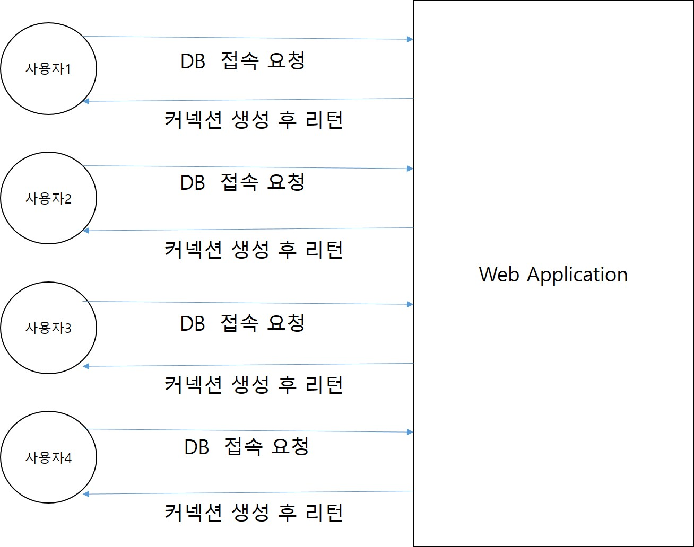
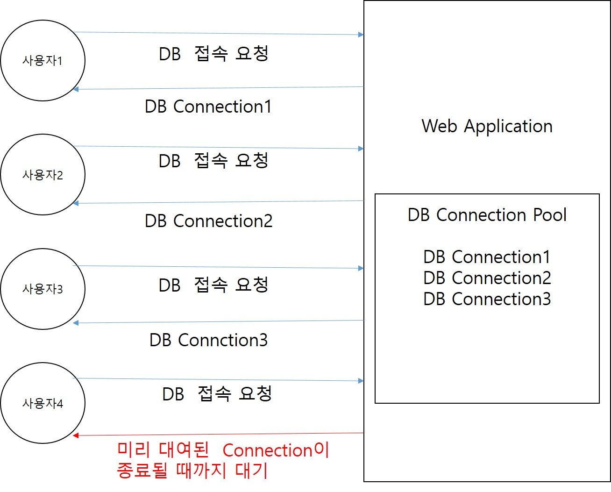
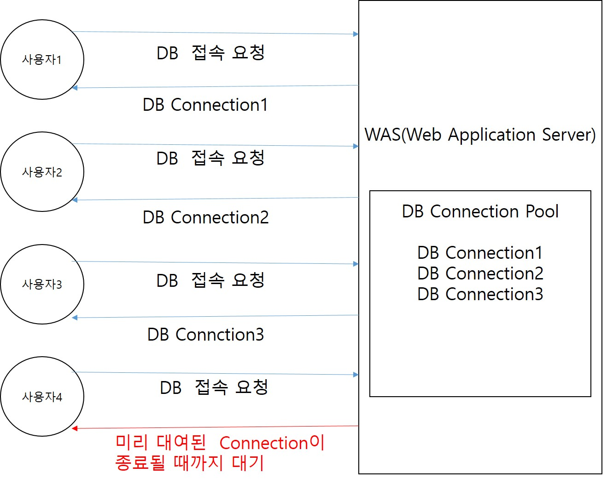

# 1. SpringFramework
## 1. AOP
### 1. DB 연동 방식(JDBC/DBCP/JNDI)
1. JDBC(Java DataBase Connectivity): 자바에서 제공해주는 DB 연결 표준 API. DB 연결 요청이 올 때마다 Web Application이 커넥션을 계속해서 생성하는 방식. 많은 사용자가 동시에 DB 접속을 요청하면 커넥션의 개수가 증가하여 DB 서버 과부하나 메모리 부족을 야기할 수 있다. 비효율적인 방식이어서 현재는 많이 사용되고 있지 않다.  
- 
2. DBCP(DataBase Connection Pool): Web Application에서 지정한 개수만큼의 DB Connection을 미리 만들어놓고 DB 접속 요청이 올 때마다 만들어놓은 DB Connection을 대여하는 방식. 초기 Connection 개수, 최대 Connection 개수, 평소에 유지되는 Connection 개수 등을 설정할 수 있다. 메모리 낭비가 되지 않도록 적절한 개수를 설정하는 것이 중요하다.  
- 
3. JNDI(Java Naming and Directory Interface): 방식은 DBCP와 같지만 DB Connection의 관리주체가 Web Application이 아닌 WAS(Web Application Server)로 변경. 설정이 간편하고 Web Application에 과부하를 방지할 수 있어서 가장 많이 사용되는 방식.
- 
### 2. AOP
1. 공통 관심인 로그출력이나 트랜잭션, 예외처리 등을 모든 비즈니스 메소드에 포함시키는 일은 매우 비효율적인 작업이다. 중간에 모듈이 변경되면 모든 메소드들을 수정해야 된다는 단점도 존재한다.
2. 스프링에서는 설정파일로 공통관심을 묶어서 관리할 수 있다.
### 3. AOP 관련 용어 정리
1. 포인트컷(pointcut): 공통 관심 코드가 실행 될 메소드. aop:pointcut의 expression 속성으로 필터링된 메소드. 만약 트랜잭션 AOP로 구성한다고 생각했을 때 insert, delete, update하는 메소드에서만 트랜잭션이 발생할 수 있게 expression을 구성하면 된다.
    - 포인트컷의 expression: 포인트컷을 지정하는 조건.
        - execution()으로 포인트 컷을 지정한다.
        - 첫 번째 파라미터(* or void or !void): 메소드의 리턴타입을 지정
        - 두 번째 파라미터: 메소드가 존재하는 클래스나 패키지를 지정.
        ```
        com.bit.springboard.service..: service에 존재하는 모든 하위 패키지 지정.
        com.bit.springboard.service..impl: service의 하위 패키지중 impl로 끝나는 모든 패키지 지정.
        com.bit.springboard.service: service 패키지만 지정.
        *Impl: Impl로 끝나는 모든 클래스 지정.
        BoardServiceImpl: BoardServiceImpl클래스만 지정.
        BoardService+: BoardService를 상속받아 구현한 모든 클래스 지정.
        ```
        - 세 번째 파라미터: 메소드를 지정.
        ```
        *: 모든 메소드 지정.
        get*: get으로 시작하는 모든 메소드 지정.
        *Board: Board로 끝나는 모든 메소드 지정.
        (..): 매개변수의 타입과 개수에 제약을 두지 않음. 어떠한 매개변수를 갖던 상관하지 않고 지정.
        (*): 매개변수의 타입은 제약을 두지 않지만 개수는 무조건 한개여야 한다.
        (com.bit.springboard.dto.BoardDTO): 매개변수는 하나면서 그 매개변수가 BoardDTO인 메소드 지정.
        (!com.bit.springboard.dto.BoardDTO): 매개변수는 하나면서 그 매개변수가 BoardDTO아닌 메소드 지정.
        (Integer, ..): 매개변수의 타입과 개수에 제약을 두진 않지만 첫 번째 매개변수는 무조건 int형인 메소드 지정.
        ```
2. 어드바이스(advice): 공통 관심에 해당되는 공통 기능 코드(consoleLog, consoleLogPlus). 어드바이스를 지정할 때는 공통 기능 코드가 실행될 시점과 함께 지정.
3. 위빙(weaving): 공통 기능 코드가 포인트 컷에 주입되는 행위. 위빙 기능이 있기 때문에 비즈니스 로직에서 공통 기능 코드를 추가하지 않고도 공통 기능 코드가 실행되는 것.
4. 애즈팩트(aspect), 어드바이저(advisor)
    - 애즈팩트: 어드바이스 + 포인트 컷. 포인트 컷에 위빙이 일어나서 공통 기능 코드가 포인트 컷에 주입된 상태를 애즈팩트라고 한다.
    - 어드바이저: 애즈팩트와 동일. 공통 기능 코드의 메소드 명을 모를 때나 공통 기능이 들어있는 클래스 명을 모를 때 애즈팩트 대신 어드바이저를 사용한다.
    - 트랜잭션을 설정할 때 commit, rollback 시점을 개발자가 알 수 없기 때문에 이 때도 애즈팩트 대신 어드바이저를 사용해서 자동적으로 commit, rollback이 일어나도록 설정한다.
### 4. AOP의 동작 시점
1. before: 포인트컷 메소드가 실행되기 전에 공통 기능 코드를 실행.
2. after-returning: 포인트컷 메소드가 정상적으로 종료되고 공통 기능 코드를 실행.
3. after-throwing: 포인트컷 메소드가 에러를 발생시켰을 때 공통 기능 코드를 실행.
4. after: 포인트컷 메소드가 정상 종료되거나 에러를 발생시키거나와 상관없이 메소드가 종료되면 무조건 공통 기능 코드 실행.
5. around: 포인트컷 메소드 실행 전 후로 한 번씩 공통 기능 코드 실행.
### 5. JoinPoint 인터페이스
1. 조인포인트(JoinPoint): 포인트컷이 될 수 있는 포인트컷 후보 메소드. 모든 비즈니스 로직 메소드가 조인포인트
```
<aop:pointcut id="allpointcut"
				expression="execution(* com.bit.springboard.service..BoardServiceImpl.*(..))"></aop:pointcut>
포인트컷을 위와 같이 설정하면 BoardServiceImpl의 insertBoard, updateBoard, deleteBoard, getBoard, getBoardList는 조인포인트면서 포인트컷인 메소드가 되고 UserServiceImpl의 join, getUser는 조인포인트지만 포인트컷이 아닌 메소드가 된다.
```
2. 조인포인트 인터페이스의 유용한 메소드
    - getSignature(): 포인트컷으로 지정되어 실행되고 있는 메소드의 시그니쳐(메소드명, 리턴타입, 매개변수)를 Signature 객체에 담아서 리턴
    - getTarget(): 호출된 메소드를 소유하고 있는 객체를 리턴
    - getArgs(): 호출된 메소드의 매개변수 값들을 Object 배열로 반환
3. Signature 객체의 메소드
    - toShortString(): 메소드의 시그니쳐(메소드명, 리턴타입, 매개변수)를 축약된 String으로 리턴
    - toLongString(): 메소드의 시그니쳐(메소드명, 리턴타입, 매개변수)를 패키지 경로까지 포함된 String으로 리턴
    - getName(): 호출된 비즈니스 로직 메소드의 메소드명 리턴
4. ProceedingJoinPoint
    - JoinPoint 상속받아 만들어졌고 proceed() 메소드를 추가한 인터페이스
    - 현재 진행중인 포인트컷 메소드를 받아오면서 proceed() 메소드를 통해서 받아온 포인트컷 메소드를 진행시킬 수 있다.
    - aop:before, aop:after-returning, aop:after-throwing, aop:after ===> JoinPoint 인터페이스 사용
    - aop:around ===> ProceedingJoinPoint 사용

## 2. JDBC Template
### 1. JDBC Template이란
1. GoF의 디자인 패턴 중 템플릿 디자인 패턴이 적용된 클래스.
2. 템플릿 디자인 패턴은 반복되는 작업을 캡슐화하여 재사용할 수 있는 패턴으로 정의하는 방식
3. DBCP(DataBase Connection Pool)에 DataSource(DB 연결 정보 객체)을 의존성으로 주입받아서 커넥션의 풀을 구성하고 커넥션들을 계속 대여하여 재사용할 수 있는 방식.
### 2. JDBC Template에서 사용가능한 메소드
1. update(): insert, update, delete 쿼리 실행. ? 인자 값을 을 어떻게 처리할 지에 따라서 두 가지 방식으로 사용가능.
    - 1번 방식: 물음표 인자 개수만큼 인자 값을 나열해서 보내는 방식
    ```
    update(쿼리문, 물음표인자값1, 물음표인자값2, 물음표인자값3);
    ```
    - 2번 방식: 물음표 인자 개수만큼의 배열을 생성하여 배열 자체를 매개변수로 보내는 방식
    ```
    Object[] args = {물음표인자값1, 물음표인자값2, 물음표인자값3};

    update(쿼리문, args);
    ```
2. queryForInt(): select 구문으로 검색된 결과 값이 정수일 때 사용하는 메소드. sum, count, avg, ... 통계함수에서 주로 사용.
3. queryForObject(): select 구문으로 검색된 결과를 특정 자바 객체에 매핑시켜 리턴받고 싶을 때 사용하는 메소드. DTO로 받고 싶을 때 해당 메소드를 사용하면 된다. 결과가 단행인 쿼리에서만 사용가능. RowMapper라는 인터페이스를 상속받아 구현한 클래스로 리턴받는데 mapRow()라는 메소드를 구현해서 개발자가 원하는 형태의 객체로 만들어서 다시 리턴가능.
4. query(): select 구문으로 검색된 결과가 다중 행일 때 사용하는 메소드. 기본적인 사용법은 queryForObject와 동일. 한 행씩 객체로 매핑해서 List에 담아서 리턴.

## 3. 트랜잭션 처리
### 1. 트랜잭션이란
1. 트랜잭션은 DB에서 처리하는 작업의 단위.
2. DDL(Insert, Delete, Update)가 실행되면 항상 commit이나 rollback이 실행돼야 트랜잭션이 종료된다.
3. 스프링에서 AOP 설정을 이용해서 트랜잭션을 처리한다.
### 2. 스프링에서의 트랜잭션
1. 트랜잭션을 설정할 때는 애즈펙트대신 어드바이저를 사용한다. 개발자가 commit과 rollback의 시점을 지정할 수 없기 때문이다.
2. 어드바이저는 쿼리가 성공하면 commit을 실패하면 rollback을 자동 호출한다.

## 4. MyBatis
### 1. MyBatis란
1. Sql Mapper Framework 중 하나의 종류. SQL 쿼리문을 Mapper라는 파일로 분리해서 관리하는 프레임워크.
2. iBatis라는 프레임워크가 독점적으로 사용되고 있었는데 2010년 구글이 iBatis를 인수하면서 이름이 MyBatis로 변경됐다.
3. 요즘 Sql Mapper Framework보다는 ORM 프레임워크(JPA, Hibernates 등)이 성행하고 있다.
### 2. MyBatis의 구조
1. DAO에 존재하던 쿼리문들을 Mapper라는 별도의 파일로 관리. 스프링프레임워크에서는 xml 파일방식만 지원. 스프링부트에서는 xml파일 방식과 어노테이션 방식도 지원.
2. MyBatis만의 설정파일을 만들어서 조회 쿼리 결과의 표출방식 지정, 결과를 담아줄 객체의 별칭을 달아주는 설정, 쿼리문이 저장되어 있는 Mapper 파일의 위치를 지정할 수 있는 등의 설정을 제공한다.
3. DAO로부터 분리된 Mapper 파일은 namespace라는 별칭을 지정하여 호출하게 되는데 관례적으로 DAO에서 분리됐기 때문에 DAO의 이름과 동일하게 설정하는 것이 대부분.
4. 매퍼 xml의 구조
```
<xml 설정>
<doctype 지정>
<mapper 설정>
    <select id="selectBoard" parameterType="int, string, map, com.bit.springboard.dto.BoardDTO,...." resultType="int, string, map, com.bit.springboard.dto.BoardDTO"></select>
    <insert></insert>
    <delete></delete>
    <update></update>
</mapper>
//DAO에서 mapper를 호출하여 사용하는 방식
mapper의 namespace값.쿼리문의 id값
```

## 5. WebApplication
### 1. Spring Applictaion의 구동
1. WAS가 구동되면서 web.xml을 읽어서 ServletContainer를 구동시킨다.
    - web.xml: 서블릿의 생명주기 관리하는 설정이 담겨있는 설정파일. 이 설정파일을 읽어서 서블릿들을 생성하는 컨테이너가 하나 생성된다.
    - 컨테이너: 설정파일을 저장하고 있는 상자. 저장되어 있는 설정파일로 어떤 동작이 일어났을 때 무언가를 생성해주는 상자.
    - context-param: 서블릿 컨테이너가 구동되면서 전달할 파라미터. 스프링 컨테이너 설정파일을 지정해서 서블릿 컨테이너가 구동되면서 스프링 부모 컨테이너를 바로 구동할 수 있도록 한다.
2. context-param으로 지정되어 있는 root-context.xml 파일을 읽어서 부모 스프링 컨테이너를 구동한다.
3. servlet과 servlet-mapping으로 설정되어 있는 요청이 들어올때마다 서블릿을 생성해주게 되는데 init-param의 설정으로 서블릿의 초기화 매개변수를 전달할 수 있다.
4. init-param에 설정된 servlet-context.xml파일을 읽어서 서블릿이 생성될 때마다 자식 스프링 컨테이너를 구동시킨다.
5. 부모 스프링 컨테이너(root-context.xml)는 Model(비즈니스 로직, DB 커넥션 관련) 관련 설정을 주로 하고 자식 스프링 컨테이너(servlet-context.xml)은 View-Controller(화면단과 정적파일들) 관련 설정을 주로 한다.
### 2. 화면에서 자바로 데이터 전송방식
1. form submit: form태그의 입력된 input 데이터를 바로 요청 url로 전송. 각 input의 name 속성이 키로 지정되어 입력된 값을 매핑해서 전송.
2. ajax를 이용한 비동기 통신 전송: ajax 비동기 통신할 때 data 속성으로 원하는 데이터를 전송할 수 있다. contentType 속성에서 전송될 데이터의 형식을 지정. json, html, text, ... 등 지정가능.
3. multipartFormData: new FormData()로 FormData의 객체를 생성해서 전송하는 방식. 파일을 전송할 때는 이 방식을 주로 사용한다. 그냥 form 태그의 enctype속성으로도 FormData객체를 생성해서 전송할 수 있다.
### 3. 요청 url 매핑 방식
1. get: 요청 객체의 body가 생성 안되는 방식. 화면에서 전송되는 모든 데이터가 파라미터(쿼리스트링 방식)로 전달된다. url에 전송되는 모든 키와 밸류가 표출. 보안상 좋지 않아서 중요한 데이터를 전송할 때는 사용되지 않는다. 하지만 다른 방식들보다 데이터 처리하는 로직이 줄어들어 속도가 빠르기 때문에 단순 조회에서 많이 사용된다.
2. post: 요청 객체의 body를 생성하여 통신하는 방식. 전송하는 데이터가 요청 객체의 body에 저장되기 때문에 url에 표출되지 않는다. 요청 객체에 body를 생성하기 때문에 get방식보다는 속도가 느리고 데이터를 숨길수 있기 때문에 보안상 용이하다. Spring Framework에서는 insert, update, delete 모두 post 방식을 사용했는데 Spring Boot에서 put 방식과 delete 방식이 추가되면서 Boot에서는 insert는 post로 update은 put으로 delete는 delete로 구분하여 사용한다.
3. put
4. delete
5. 요청 url 방식 지정하는 법
```
//jsp단
<form action="/" method="get/post">

</form>

$.ajax({
    url: "/",
    type: "post" or "get" or "put" or "delete"
});

//java단
//RequestMapping: 매핑된 url 요청이 왔을 때 해당 메소드를 실행
//방식을 여러개로 분리하게 되면 같은 매핑 url이어도 다른 요청으로 인식
@RequestMapping(value="/", method=RequestMethod.GET or RequestMethod.POST) or 
@GetMapping("/")
@PostMapping("/")
메소드
```
### 4. 자바에서 전송된 데이터 받는 방법
1. @RequestParam("화면에서 전송한 키") 어노테이션을 이용해서 변수에 할당하는 방식
```
<form action="test.do" method="get">
    <input name="name">
    <input name="tel">
    <input type="submit" value="전송">
</form>

public String testGet(@ReqeustParam("name") String name,
        @ReqeustParam("tel") String tel) {

}
```
2. @RequestParam을 이용해서 Map에 할당
```
<form action="test.do" method="get">
    <input name="name">
    <input name="tel">
    <input type="submit" value="전송">
</form>

public String testGet(@ReqeustParam Map<String, Object> paramMap) {

}
```
3. Command 객체를 이용한 데이터 받기
    - Command 객체란 메소드의 매개변수로 선언된 객체
    - 메소드의 매개변수로 클래스 타입의 변수를 선언하면 자동으로 인스턴스화가 진행된다.
    - 전송된 데이터의 키값과 같은 변수명의 멤버변수에 데이터들이 자동으로 할당된다.(getter, setter 무조건 생성)
```
<form action="test.do" method="get">
    <input name="name">
    <input name="tel">
    <input type="submit" value="전송">
</form>

//NameDTO
private String name;
private String tel;

public void setName(String name) {
    this.name = name;
}
public String getName() {
    return this.name;
}
public void setTel(String tel) {
    this.tel = tel;
}
public String getTel() {
    return this.tel;
}

public String testGet(NameDTO nameDTO) {

}
```
### 5. 자바에서 화면단으로 데이터 전송 방법
1. Model 객체를 이용
    - Model 객체의 addAttribute("키", "밸류") 메소드로 전송할 데이터 저장. 화면단에서는 키로 데이터를 꺼내서 사용할 수 있다.
```
public String test3Get(Model model) {
    model.addAttribute("key", "value");
}

```
2. HttpServletRequest 객체를 이용
    - HttpServletRequest의 setAttribute("키", "밸류") 메소드를 이용해서 화면단으로 데이터를 전송.
    - HttpServletRequest 클래스는 Servlet을 상속받은 Cotroller 클래스에서만 사용가능한 클래스로. 요청 상태나 요청 헤더, 요청 바디 등의 정보를 담고있어서 유요하게 사용할 수 있다.
```
public String test3Get(HttpServletRequest request) {
    request.setAttribute("key", "value");
}
```
3. HttpSession 객체를 이용
    - HttpSession 객체의 setAttribute("key", "value") 메소드를 이용해서 화면단으로 데이터 전송.
    - HttpSession 클래스는 사용자가 웹 사이트에 접속할 때 생성되는 세션을 받아오는 클래스. 동작이 없으면 세션이 만료되는데 기본값은 30분으로 지정되어 있다. Model, Request는 하나의 요청이 끝나면 데이터가 사라지는 데 Session은 만료되기 전까지 데이터를 보관한다. 로그인된 회원의 정보나 세션이 유지되는 동안 지속돼야하는 데이터들을 저장한다. 요즘에는 세션에도 보안이슈가 있어서 회원정보는 거의 대부분 토큰으로 처리.
```
public String test3Get(HttpSession session) {
    session.setAttribute("key", "value");
}
```
### 6. el표기법과 JSTL
1. el표기법(Expression Language)
    - JSP에서 ${}표기되는 기법
    - Java에서 받아온 데이터를 표출할 때 주로 사용
    - Model, Request, Response, Session에 담긴 값을 꺼낼 때 유용하게 사용.
    - 기존에 JSP에서 자바 데이터를 꺼낼 때 <%= %> 이 방식을 사용했는데 JSP에서 자바소스를 줄이기 위해 고안된 방식
    - 기존의 방식보다 간편하고 편리해서 많이 사용되고 있다.
2. JSTL(JSP Standard Tag Library)
    - el표기법이 자바에서 받아온 데이터를 표출하기 위한 기능이라면 JSTL은 자바문법을 사용하기 위한 기술
    - JSP 상단에 JSTL 선언문을 선언해야 한다.
    ```
    <%@ taglib uri="http://java.sun.com/jsp/jstl/core" prefix="c" %>
    ```
    - c: 으로 시작하는 태그를 이용해서 for반복문이나 if조건문 등을 사용할 수 있다.
    ```
    <c:forEach items="${자바로부터 받아온 목록의 키}" var="목록에서 한 행씩 꺼내서 쓸 변수명(직접지정)"
    varStatus="상태 변수명(직접지정)">
    //varStatus에서 사용할 수 있는 값
    //상태변수명.index => 현재 꺼내온 데이터의 인덱스(0부터 시작)
    //상태변수명.count => 현재 꺼내온 데이터의 개수(1부터 시작)
    </c:forEach>

    <c:if test="${자바로부터 받아온 목록의 키.변수명 조건(==, !=, >, <, >=, <=, eq, ne, empty, not empty .....) 논리연산자(&&, ||, and, or)로 조건을 여러개 붙일 수 있다.}">
    </c:if>

    <c:choose>
        <c:when test="${조건1}>조건1이 참일 때 실행될 내용</c:when>
        <c:when test="${조건2}>조건2이 참일 때 실행될 내용</c:when>
        ...
        <c:when test="${조건n}>조건n이 참일 때 실행될 내용</c:when>
        <c:otherwise>위 조건이 모두 거짓일 때 실행될 내용</c:otherwise>
    </c:choose>
    ```